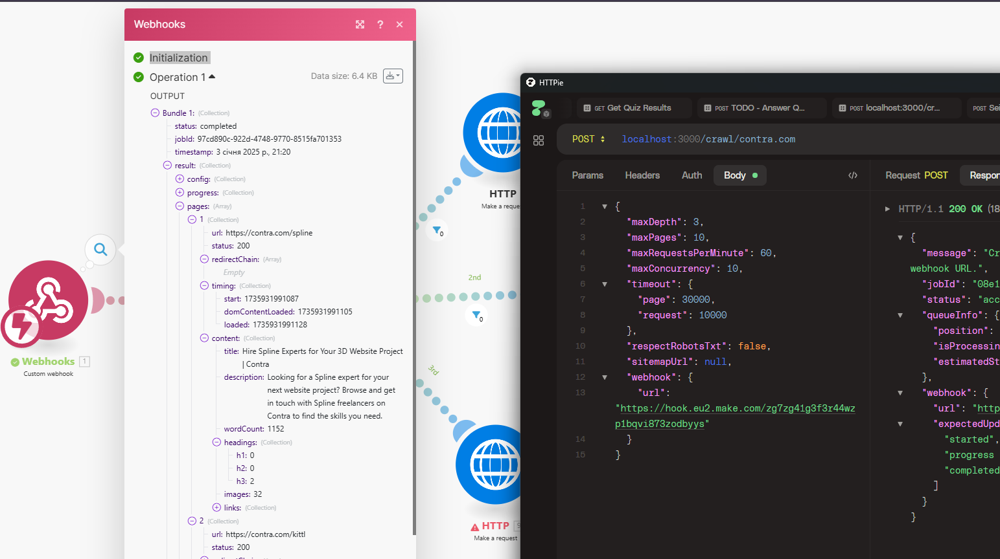
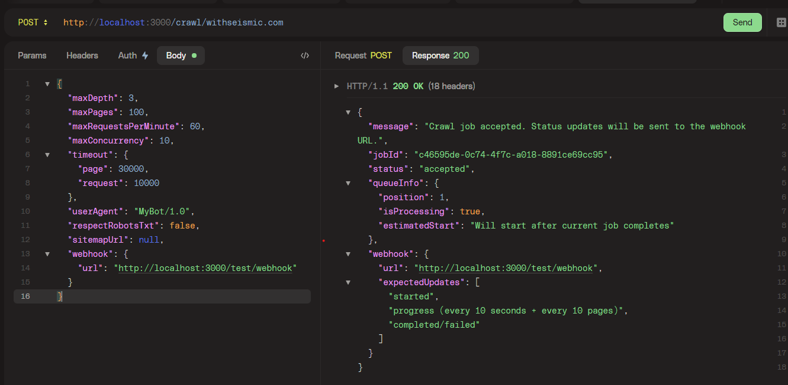

# GTM Crawler

[](https://github.com/dougwithseismic/gtm-crawler/stargazers)

[](https://opensource.org/licenses/MIT)
[](https://www.typescriptlang.org/)
[](https://nodejs.org/)
[](https://pnpm.io/)
[](https://playwright.dev/)
[](http://makeapullrequest.com)

A local-first crawler for Go To Market teams with big ambitions.

This tool allows you to locally crawl websites and extract all the data you need for your GTM strat. The real win here is that Clay, Make, n8n etc can all interact with the tool, all whilst it runs locally on your machine.

You can make http requests to your local instance just like you would any other API endpoint, and specify the webhooks you wanna fire off on successful crawling progress/completion.



With the right plugins (I'll build examples), you should be able to do BASICALLY WHATEVER YOU WANT and get it into your automations.

- Scrape profiles from LinkedIn
- Grab all G2 reviews from competitors / potential prospects
- Turn pages into Markdown and throw it through an agent etcetc.

Build custom plugins to do whatever you want, set up webhook notifications, and add seamless integration with Clay.com and n8n thanks to ngrok tunnels (your machine can communicate back and forth with internet services.)

## Quick Example

```bash
curl -X POST "http://localhost:3000/crawl/withseismic.com" \
  -H "Content-Type: application/json" \
  -d '{
  "maxDepth": 3,
  "maxPages": 100,
  "maxRequestsPerMinute": 60,
  "maxConcurrency": 10,
  "timeout": {
    "page": 30000,
    "request": 10000
  },
  "userAgent": "MyBot/1.0",
  "respectRobotsTxt": false,
  "sitemapUrl": null,
  "webhook": {
    "url": "http://localhost:3000/test/webhook"
  }
}'
```

Or using HTTPie / Insomnia / Postman (recommended for development - [httpie](https://httpie.io/desktop) Right click > Import > Paste in Curl)



This example shows a basic crawl of withseismic.com with common configuration options. The crawler will:

- Crawl up to 100 pages
- Go 3 levels deep into the site
- Limit to 60 requests per minute
- Run 10 concurrent crawls
- Send results to a test webhook

## Playground Service

Sometimes you'll be wishing that you could execute your own code in a similar way to the crawler - that's why the Playground service exists. It provides the same plugin environment and webhook capabilities but runs arbitrary code instead of crawling websites.

### Quick Example

```bash
curl -X POST "http://localhost:3000/playground/jobs" \
  -H "Content-Type: application/json" \
  -d '{
  "input": "Hello, World!",
  "plugins": ["example"],
  "webhook": {
    "url": "http://localhost:3000/test/webhook",
    "on": ["completed"]
  },
  "async": true
}'
```

The playground service offers:

- Same plugin architecture as the crawler
- Webhook notifications for job progress
- Synchronous or asynchronous execution
- Storage system for plugins to share state
- Metrics collection and summarization

Perfect for:

- Running LLM chains with progress tracking
- Processing data through multiple stages
- Executing long-running tasks with webhooks
- Testing and prototyping new plugins

### Example Response

```json
{
  "jobId": "job-uuid",
  "status": "completed",
  "result": {
    "metrics": [{
      "example": {
        "processedAt": "2024-01-03T12:00:00.000Z",
        "inputLength": 13,
        "outputLength": 13,
        "processingTimeMs": 50
      }
    }],
    "summary": {
      "example": {
        "totalProcessed": 1,
        "averageProcessingTime": 50,
        "totalInputLength": 13,
        "totalOutputLength": 13
      }
    }
  }
}
```

## Architecture Overview


The diagram above shows how the GTM Crawler processes requests:

1. Your automation platform sends a crawl request with webhook configuration
2. The crawler processes the target website page by page
3. Plugins extract and analyze content from each page
4. Progress updates and final results are sent via webhooks
5. Your automation workflow continues with the processed data

## Table of Contents

- [Installation](#installation)
- [Tunnel Setup](#tunnel-setup)
- [Quick Start](#quick-start)
- [Playground Service](#playground-service)
- [Using with n8n](#using-with-n8n)
- [Using with Clay.com](#using-with-claycom)
- [Webhook Integration](#webhook-integration)
- [Writing Custom Plugins](#writing-custom-plugins)
- [API Reference](#api-reference)

## Installation

1. Clone the repository:

```bash
git clone https://github.com/dougwithseismic/gtm-crawler.git
cd gtm-crawler
```

2. Install dependencies:

```bash
pnpm install
```

## Tunnel Setup

The crawler requires a public URL for webhook notifications. We use ngrok for this:

1. Run the tunnel setup script:

```bash
pnpm setup:tunnel
```

2. Follow the prompts:
   - If you don't have an ngrok account, the script will guide you to create one
   - Copy your ngrok auth token from <https://dashboard.ngrok.com/get-started/your-authtoken>
   - The script will install ngrok if needed and configure it with your token

3. Save your tunnel URL:
   - The script will create a tunnel and show you the public URL
   - Save this URL - you'll need it for webhook configurations
   - Example: `https://your-subdomain.ngrok.io`

## Quick Start

1. Start the service:

```bash
pnpm dev
```

The service will automatically create a tunnel and display the public URL in the console.

2. Test the crawler with the built-in test webhook:

```bash
# Replace YOUR_TUNNEL_URL with the URL shown in your console
curl -X POST "YOUR_TUNNEL_URL/crawl/example.com" \
  -H "Content-Type: application/json" \
  -d '{
    "webhook": {
      "url": "YOUR_TUNNEL_URL/test/webhook"
    }
  }'
```

3. Watch the webhook responses in your console

## Using with n8n

1. Create a new workflow in n8n
2. Add an HTTP Request node:
   - Method: POST
   - URL: Your tunnel URL + /crawl/[target-domain]
   - Body:

   ```json
   {
     "maxDepth": 3,
     "maxPages": 100,
     "webhook": {
       "url": "https://your-n8n-webhook-url",
       "on": ["completed"]  // Only get final results
     }
   }
   ```

3. Add a Webhook node to receive results:
   - Authentication: None (or add headers in the crawler request)
   - Method: POST
   - Path: /crawler-webhook
   - Response Code: 200
   - Response Data: JSON

4. Use the "Function" node to process results:

```javascript
return {
  json: {
    processedData: items[0].json.result.summary,
    // Add your processing logic here
  }
}
```

## Using with Clay.com

1. Create a new Clay table
2. Add a "Webhook" column
3. In your Clay workflow:

```javascript
// Clay.com workflow example
const response = await fetch('https://your-tunnel-url/crawl/' + domain, {
  method: 'POST',
  headers: { 'Content-Type': 'application/json' },
  body: JSON.stringify({
    maxPages: 100,
    webhook: {
      url: clayWebhookUrl,
      headers: { 'X-Clay-Token': 'your-token' },
      on: ['completed']
    }
  })
});

// The crawler will send results to your Clay webhook
```

## Webhook Integration

The crawler supports flexible webhook configurations:

```typescript
interface WebhookConfig {
  url: string;
  headers?: Record<string, string>;
  retries?: number;
  on?: ('started' | 'progress' | 'completed' | 'failed')[];
}
```

Example webhook payloads:

1. Job Started:

```json
{
  "status": "started",
  "jobId": "job-uuid",
  "timestamp": "2024-01-03T12:00:00.000Z"
}
```

2. Progress Update:

```json
{
  "status": "progress",
  "jobId": "job-uuid",
  "timestamp": "2024-01-03T12:00:10.000Z",
  "progress": {
    "pagesAnalyzed": 50,
    "totalPages": 100,
    "currentUrl": "https://example.com/page"
  }
}
```

3. Job Completed:

```json
{
  "status": "completed",
  "jobId": "job-uuid",
  "timestamp": "2024-01-03T12:01:00.000Z",
  "result": {
    "pages": [...],
    "summary": {...}
  }
}
```

## Writing Custom Plugins

Create a new plugin by implementing the `CrawlerPlugin` interface:

1. Create a new file in `src/services/crawler/plugins/`:

```typescript
import { CrawlerPlugin, Page } from '../types/plugin';
import type { CrawlJob } from '../types.improved';

interface MyMetrics {
  customValue: number;
}

interface MySummary {
  totalCustomValue: number;
}

export class MyPlugin implements CrawlerPlugin<'myPlugin', MyMetrics, MySummary> {
  readonly name = 'myPlugin';
  enabled = true;

  // Called once when the crawler service starts
  async initialize(): Promise<void> {
    // Set up plugin resources
  }

  // Called before starting to crawl a website
  async beforeCrawl(job: CrawlJob): Promise<void> {
    console.log(`Starting crawl of ${job.config.url}`);
  }

  // Called before each page is loaded
  async beforeEach(page: Page): Promise<void> {
    // Add custom scripts or prepare page
    await page.addScriptTag({
      content: `window.__myPlugin = { startTime: Date.now() };`,
    });
  }

  // Main page analysis
  async evaluate(page: Page, loadTime: number): Promise<Record<'myPlugin', MyMetrics>> {
    const metrics = await page.evaluate(() => ({
      customValue: document.querySelectorAll('.my-selector').length,
    }));
    return { myPlugin: metrics };
  }

  // Called after page analysis is complete
  async afterEach(page: Page): Promise<void> {
    // Clean up page modifications
    await page.evaluate(() => {
      delete (window as any).__myPlugin;
    });
  }

  // Called after completing a website crawl
  async afterCrawl(job: CrawlJob): Promise<void> {
    console.log(`Completed crawl of ${job.config.url}`);
  }

  // Aggregate results from all pages
  async summarize(pages: Array<Record<'myPlugin', MyMetrics>>): Promise<Record<'myPlugin', MySummary>> {
    return {
      myPlugin: {
        totalCustomValue: pages.reduce((sum, page) => sum + page.myPlugin.customValue, 0),
      },
    };
  }

  // Called when the crawler service shuts down
  async destroy(): Promise<void> {
    // Clean up plugin resources
  }
}
```

{}Register the plugin with the crawler:

```typescript
import { MyPlugin } from './plugins/my-plugin';

const crawler = new CrawlerService({
  plugins: [new MyPlugin()],
  config: { debug: true }
});
```

### Plugin Lifecycle

The plugin system provides several hooks that are called at different stages:

1. **Service Lifecycle**
   - `initialize()`: Called when the crawler service starts
   - `destroy()`: Called when the crawler service shuts down

2. **Job Lifecycle**
   - `beforeCrawl(job)`: Called before starting a website crawl
   - `afterCrawl(job)`: Called after completing a website crawl

3. **Page Lifecycle**
   - `beforeEach(page)`: Called before loading each page
   - `evaluate(page, loadTime)`: Called to analyze each page
   - `afterEach(page)`: Called after analyzing each page

4. **Results Processing**
   - `summarize(pages)`: Called to generate final analysis

All hooks except `evaluate` and `summarize` are optional. Use them to:

- Set up and clean up resources
- Add custom scripts to pages
- Track crawling progress
- Collect additional metrics
- Clean up page modifications

## API Reference

See the [API Documentation](./docs/api-reference.md) for detailed endpoint specifications and configuration options.

## License

MIT
